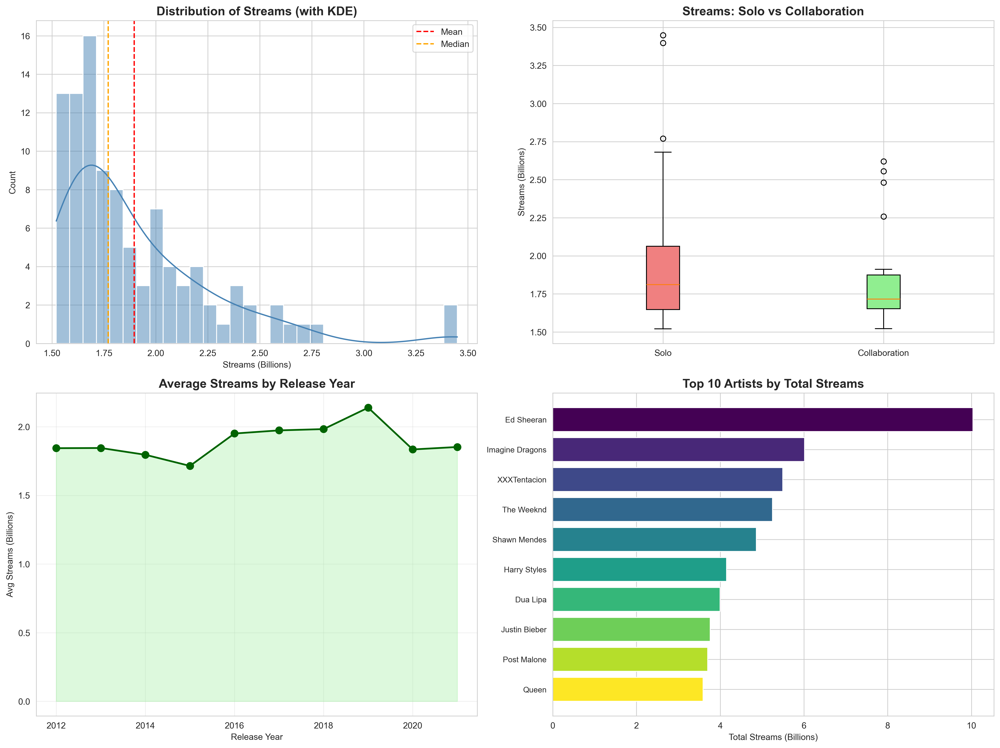

# Case Study - Spotify Data Analysis 🎵🎹🎸

### Core Components

main.py - Complete analysis pipeline with:

Advanced exploratory data analysis
Multiple A/B testing methods (t-tests, Mann-Whitney, Kruskal-Wallis)
Predictive modeling (Random Forest, Gradient Boosting)
Effect size calculations (Cohen's d)
Statistical inference with proper interpretation

statistical_tests.py - Reusable A/B testing framework:

Automatic test selection based on data properties
Multiple testing methods (parametric & non-parametric)
Effect size calculations
Bonferroni correction for multiple comparisons

